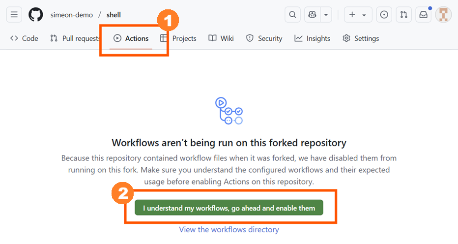

# Shell / Git Assignment
You work in the data team at a consulting firm, and one of your team's products is helping companies optimize and manage their cloud hosting expenditures.

Your team has an existing bash script that initializes an analysis directory for each new client. This script is shared amongst members of the team.

You've been asked to update this script to also automate the initial organization of data files provided by clients.

## Instructions

### Setup
1. **Forking the Repository**: If you have not already done so, fork this Shell learning module repository following these [instructions](https://github.com/UofT-DSI/onboarding/blob/main/onboarding_documents/submissions.md#setting-up). 
   - Forking creates a copy of the main repository in your GitHub account. This allows you to work on your version without affecting the original repository.

2. **Enable GitHub Actions**: Click on the **Actions** tab in your repository and enable workflows if prompted.  


2. **Clone Your Fork To Your Computer**: To make edits and test your script.
   ```bash
   cd <sensible directory on your computer>
   git clone <url to your repo>
   ```

2. **Create a Branch for Your Work**: To keep your changes organized, create a new branch named `assignment`:
   ```bash
   git switch -c assignment
   ```

---

### Part 1: Update the Data Ingest Script
1. **Modify the Script**: Using the template in ``02_activities/assignments/assignment.sh``, fill in the correct commands as described by the comments.
    - It may help to paste your commands into the Terminal as you write your script (or vice versa) to test as you go

2. **Test Your Script Locally**: Execute your script to ensure it works as expected. You may need to make additional tweaks and re-run it until you are satisfied with the results.
    ```bash
    bash assignment.sh
    ```

   - Check if the expected directories are created. (eg. by browsing the directory with `cd` and `ls`)
   - Verify that files are moved or copied as expected.
   - Ensure that files that should be deleted are no longer present.
   - Ensure your script works regardless

3. **Commit Your Changes**: As you complete parts of your script and confirmed that it is working correctly, stage and commit your changes to ensure your progress is saved.
    ```bash
    git add assignment.sh
    git commit
    ```

    - Remember that the script is shared amongst your team members. Your script should run properly in any directory and should not have any hardcoded absolute paths or rely on advanced functionality not available in standard Bash.
    - *Note*: Your assignment is graded solely based on `assignment.sh`. 
    - ‼️ You **must not** include any data files created during testing of your script and you **must not** change any other files.

4. **Push Your Changes to GitHub**
   ```bash
   git status                   # check that your working directory is clean (all changes committed)
   git push origin assignment   # push your changes
   ```
   - ‼️ **Do not** push to `main`

5. **Create a pull request**
   - Open a pull request from your `assignment` branch to your repository's `main` branch.
   - The autograder will run automatically and post your assignment grade as a comment.
   - Ensure the pull request is **NOT** made to the `UofT-DSI` organization
   - ‼️ **Do not merge** your pull request until the end of the module. Your teaching team will only grade *open* pull requests.

6. **Repeat steps 1-4 as needed**: As you make tweaks to your assignment, push new changes to your `assignment` branch to rerun the autograder
   - There's no need to create a new pull request
   - Pushes to the `assignment` branch will trigger additional runs

---

### Part 2: Merge in Updates from Your Coworkers
Your coworkers have made some other changes to the script. You'll need to incorporate their updates and resolve any conflicts.
1. **Merge the Updates**: Use the following command to pull in changes from the coworker's branch:
   ```bash
   git pull https://github.com/UofT-DSI/shell coworker-changes --no-rebase
   ```
2. **Resolve Merge Conflicts**: If there are any conflicts, use ```git status``` to see which files are affected, resolve the conflicts manually, and then mark them as resolved.
3. **Commit the Merge**: Once all conflicts are resolved, commit the merge.
1. **Re-test Your Script**: Make sure that your script still works after merging the updates and make any changes as necessary

---

## Submission Information

🚨 **Please review our [Assignment Submission Guide](https://github.com/UofT-DSI/onboarding/blob/main/onboarding_documents/submissions.md)** 🚨 for detailed instructions on how to format, branch, and submit your work. Following these guidelines is crucial for your submissions to be evaluated correctly.

### Grading guidelines:
This assignment is considered complete if all autograder tests pass successfully and your Pull Request is approved by the github-actions bot, and incomplete otherwise.

### Submission Parameters:
* The branch name for your repo should be: `assignment`
* What to submit for this assignment:
    * One or more commits that update the `assignment.sh` script
* What the pull request link should look like for this assignment: `https://github.com/<your_github_username>/shell/pull/<pr_id>`
    * Open a private window in your browser. Copy and paste the link to your pull request into the address bar. Make sure you can see your pull request properly. This helps the technical facilitator and learning support staff review your submission easily.

Checklist:
- [ ] Create a branch called `assignment`.
- [ ] Ensure that your repository is public.
- [ ] Review [the PR description guidelines](https://github.com/UofT-DSI/onboarding/blob/main/onboarding_documents/submissions.md#guidelines-for-pull-request-descriptions) and adhere to them.
- [ ] Verify that your link is accessible in a private browser window.
- [ ] Verify the autograder has run and approved your pull request
