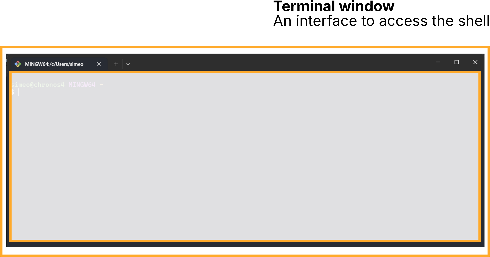
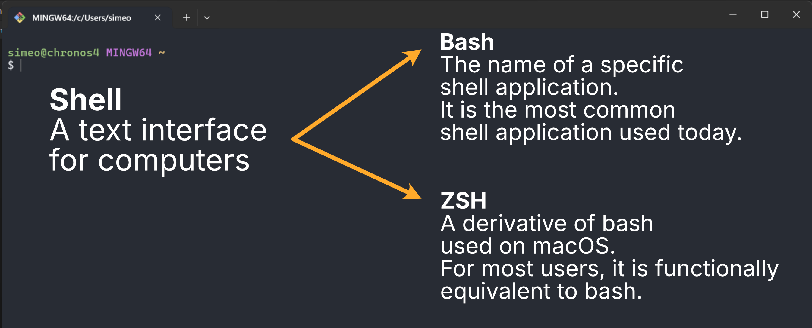
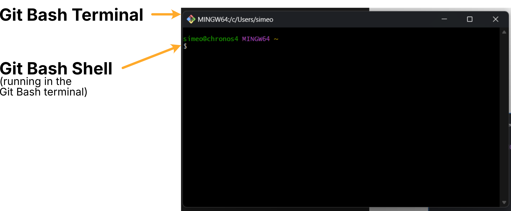
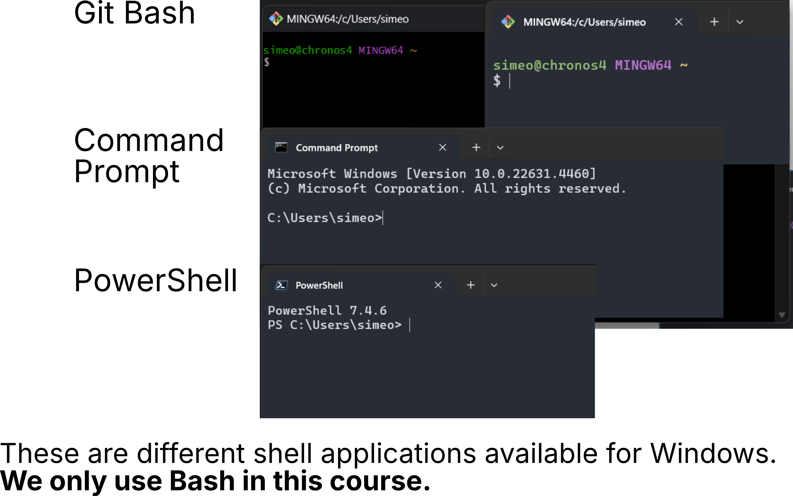
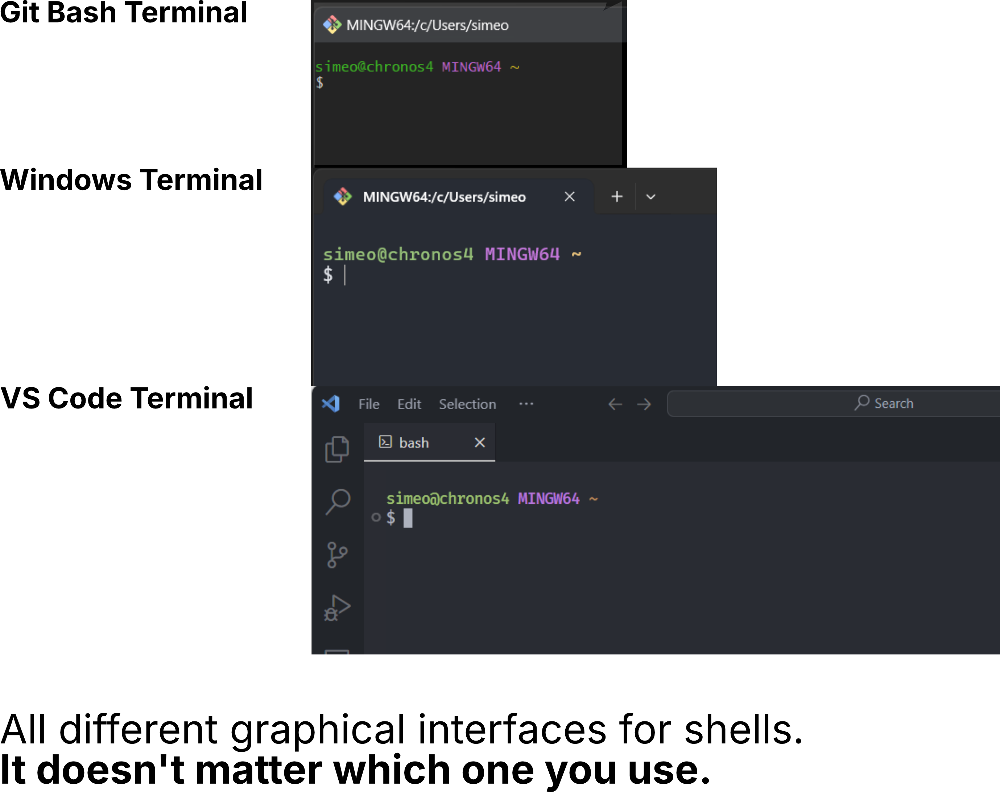

# Unix Shell

```
$ echo "Data Sciences Institute"
```

---
### What is Unix?

Unix was a text-based operating system created in 1970. Many of its derivatives are commonly used today, including Linux and MacOS.

Linux powers
* 90% of global cloud infrastructure
* 100% of the world's top 500 high performance computers
* 97% of embedded and IoT devices

---
*Bash* and similar shells 
* are the primary way of interacting with most production Linux systems
* empower you to quickly and easily navigate the system, manipulate files, and automate tasks

---
### So what is the shell?

A *shell* is any user interface/program that takes an input from the user, translates it into instructions that the operating system can understand, and conveys the output back to the user.

---
There are various types of user interfaces:

- graphical user interfaces (GUI)
- touch screen interfaces
- command line interfaces (CLI)

---
### And what is Bash?

We'll be focusing on command line interfaces (CLI), more
specifically Bash, which stands for the Bourne Again SHell.

On Windows: open the **Git Bash** or **Windows Terminal** app
On MacOS or Linux: open the **Terminal** app

On newer macs, the default shell is zsh, which is almost identical to Bash.

---
### Clearing up an abundance of terminology


---
### Clearing up an abundance of terminology


---
### Clearing up an abundance of terminology


---
### Clearing up an abundance of terminology


---
### Clearing up an abundance of terminology


---
### Let's get started!

First, we'll open our terminal. As mentioned earlier, this is most
likely called terminal and can be found by searching our
computer, which on a Mac would be through cmd + space

---
Let's take a look at the terminal. What do we notice?

- last login
- name
- location
- shell

---
### Looking at the Shell
Let's start with a few commands and see what happens in our
terminal.

```bash
$ echo Rachael
$ date
$ cal
$ lksjfs
```

---
- What happens when we type something that does not exist?
- What happens with errors?

---
# Getting help and accessing documentation
Bash includes built-in documentation for all commands

```bash
$ man ls
```

Retrieve the **man**ual for each commands using `man`.
* Many manuals are also available online


---
View a list of commonly used Bash commands

```bash
$ help
```

---
# Navigate Files / Directories

---
## Directories

Let's try three commands that help us navigate our system:

1. When using Bash, we always have a *working directory*:

```bash
$ pwd
```

`pwd` prints our current working directory. If we ever need to know
where we are, we can execute this command.

---
2. To know what files and folders exist in our working directory,
   we can use the code below:

```bash
$ ls
```

---
3. We can change the working directory using the following command:

```bash
$ cd
```

By default, `cd` changes your *working directory* to your *home
directory*. You can also use `cd` to set your *working directory* by
including the desired *pathname*

```bash
$ cd Desktop
```

---

```bash
$ cd Desktop
```

Note #1: In this example
* We can change the behaviour of the `cd` command by providing *arguments*
* By default, `cd` changes the *working directory* to our *home directory*
* By adding `Desktop` after the `cd` command, we change to the `Desktop` directory instead
* Most other bash commands have their own *arguments* that allow you to modify the behaviour and effect of the command

---

Let's try using a *pathname argument* with the `ls` command too!

```bash
$ cd
$ ls Desktop
```

---

```bash
$ cd Desktop
```

Note #2:
* we were able to refer to the `Desktop` directory using only its directory name because it existed within our *working directory* at the time the command was *called*
* in this context, `Desktop` is a *relative pathname*
* to refer to paths outside our working directory, use the full path instead


If we wanted to change the working directory to a directory
outside of our working directory, we would need to specify an *absolute pathname*:

```bash
$ cd /Users/rachellam/Documents
$ cd /c/Users/simeo/Downloads
```

---
## Paths

As we've seen, directory names separated by slashes are paths.
There are two types of paths, _absolute_ and _relative_.

- An *absolute pathname* begins at the *root directory* and
  includes each directory, separated by slashes until the
  desired directory or file is reached.
- A *relative pathname* starts from the current *working directory* and
  uses symbols `.` or `..` to represent relative positions in the
  file tree.

---
Using `cd` and `pwd` let's take a look at how we can use
*absolute* and *relative pathnames*.

```bash
$ cd /usr/bin
$ pwd
```

```bash
$ cd /usr
$ pwd
```

```bash
$ cd ..
$ pwd
```

---
## Working with Files / Directories

We're going to learn some basic commands to begin some
preliminary coding. We'll also be using these throughout the
module, so it's important to understand how they work now:

- create directory `mkdir`
- create an empty file `touch`
- copy `cp`
- move and rename `mv`
- remove `rm`

---
## Commands

---
### mkdir

First let's make a directory. It's important to remember what
directory you're working in currently, because that's where the
new directory will be made. Let's assume for now, we're working
on our Desktop.

```bash
$ mkdir my_directory
```

We can also create multiple directories at the same time:

```bash
$ mkdir dir1 dir2 dir3
```

---
### touch

We can also make new empty files from the command line.
Using `touch`, we can make a new file in our
*working directory*.

```bash
$ touch file1
```

We can also create a specific file type by adding the extension:

```bash
$ touch file1.txt
```

---
### cp

Now we're going to copy a file that we have in our *working directory*. It
can be any file but remember to include the extension or if it
has multiple characters, special characters and spaces, to wrap
it in quotes.

```bash
$ cp file1 file2
```

---
We can also copy files or directories into a directory.

```bash
$ cp file1 dir1/
```

And all files from one directory into another using *wildcards*:

```bash
$ cp dirl/* dir2
```

---
#### Wildcards
*Wildcards* enable us to use commands on more than one file at a time.
The `*` is a placeholder that represents zero or more characters when used in a *pathname*.

For example:
* `./*` matches all files and folders in the current directory
* `./*.txt` matches all files and folders that have a txt extension in the current directory
* `/home/simeo/project1_*` matches all files and folders that begin with `project1_` in the `/home/simeo` directory

---
*Wildcards* are one of many reasons why bash so powerful!

Many of the features in bash empower you to work with a large number of files easily.


---
There are some useful *options* that accompany `cp`:
| Option | Description |
| ------ | ------------------------------------------------------------- |
| -i | Before overwriting an existing file, prompt the user for confirmation. |
| -R | Recursively copy directories and their contents. |
| -v | Display informative messages as the copy is performed. |

---
### mv

The mv command enables us to move and rename files and
directories, depending on how it's used. In th example below, `mv` renames `file1` to `file2`.

Rename a file:
```bash
$ mv file1 file2
```

Here, `mv` moves `file1` from the *working directory* into `./dir1`:
```bash
$ mv file1 dir1
```

---
We can also move directories into other directories:

```bash
$ mv dir1 dir2
```

---

```bash
$ mv dir1 dir2
```

In this case, if `dir2` exists, `dir1` will be moved into `dir2` (eg. from `./dir1` to `./dir2/dir1`). 

If `dir2` does not exist, `dir1` will be renamed to `dir2`. 

In both cases the entire directory will be affected (moved into another directory, or renamed), rather than the contents.

---
Let's say we're in the directory `Desktop` and we just moved
`file1` into `dir1` but now we want to put it back in `Desktop`. How would we move a file out of a directory into another one? Unfortunatly we can't just say

```bash
$ mv file1 Desktop
```

because `file1` does not exist in `Desktop` any more and the command will try and rename `file1` to `Desktop`.

---
The answer involves using *absolute pathnames* and the tilde `~` notation:

```
$ mv dir1/file1 ~/Desktop
```

The `~` is shortform for your *home directory*.

---
If we just wanted to move `file1` into `dir2` (if `dir2` is in our *working directory*), we could type:

```bash
$ mv dir1/file1 dir2
```

---
What if we want to move just the contents of dir1 to another
directory rather than the whole folder? 

HINT: it is very similar to copying (`cp`).

---
Move just the contents of dir1 to another
directory rather than the whole folder:

```bash
$ mv dir1/* dir2
```

This is a combination of the directory `dir1`, pathnames `/` and wildcards `*`. Here, `dir1/*` takes the all the contents of `dir1` and puts it in `dir2`.

---
We could also use the same technique to specify certain files to move rather than all of them. 

How would we move all txt files from `dir1` into `dir2`?

---
#### Questions?

We're starting to combine our knowledge of files, directories and pathnames with some basic commands. How do we feel up to this point?

---
### rm

To remove files we use the command `rm`. Because we're now
deleting files, it's important that you're sure of what you're deleting because there is no way to undo. Fortunately!! there
are ways to do this.

```bash
$ rm file1
```

Without specifying any *options*, `file1` will be deleted
without any feedback.

---
To ensure we want to delete something, we can use the option `-i` (interactive) that we learned earlier.

```bash
$ rm -i file1
```

This will prompt a question asking us if we want to delete `file1`. We can respond with `y` (yes) or `n` (no).

---
If we want to delete a directory, we need to use the option `-r` (recursive) as we did when copying (`cp`). This will recursively delete everything inside of the directory and the directory itself.

```bash
$ rm -r dir1
```

---
If we're specifying multiple deletions and a directory does not exist, the shell will tell us. If we don't want that message, we can add the `-option`, `-f` (force). Force will override `-i` if it is included.

1. How do you delete multiple directories?
2. What happens if you delete multiple directories with `-i`?
3. What happens if you delete multiple directories with `-i` but one does not exist?

---
Remember, it's extremely important to remember that you cannot undo `rm`. This means, if you start using wildcards to specify filenames and don't include `-i`, you could delete things by accident. For example, let's say you want to delete all `.txt` files in a directory:

```bash
$ rm *.txt
```

If you accidently add a space between `*` and `.txt`,the `rm` command will delete all the files in the directory and then try to find a `.txt` file which does not exist because it delete everything.


---
## Working with text files
---
Output the contents of any text file using `cat`

```bash
$ cat file1.txt
```

* Quick way to preview file contents
* Note, this might flood your terminal if the file is too big.

---
Write the output of a command to a text file using `>` or `>>`

```bash
$ ls >> dirlist.txt
```

* `>` replaces the destination file (deletes existing content)
* `>>` appends to the destination file

---

We can also write custom content

```bash
$ echo "Hello, world!" > myfile.txt
```

---
We can also edit text files in the command line using `nano`

```bash
$ nano file1.txt
```

To exit `nano`, press Control + X. The shortcuts are also shown at the bottom of the terminal while in the `nano` editor, where `^` denotes the Control key.

---
For more complex edits, we can launch Visual Studio Code directly from the command line.

```bash
$ code file1.txt
```

Note: MacOS users may need to setup the `code` command first.

---
## Bash scripts
---
We can write down a list of commands in a *script*, useful for
* A set of commands we need to frequently *execute* together
* Sharing commands with others

A bash *script* is a text file with commands on different lines.
* bash will *execute* each command in sequence

---
Lines that begin with a `#` are *comments* that are ignored by bash.
* Use *comments* to annotate your thought process

```bash
# copy text files from temp directory
cp tempdir/*.txt data/

# delete the rest of the temporary files
rm tempdir/*
```

---
Bash scripts usually have a special *comment* as the very first line that indicates which shell should be used to run the script.
* This is also known as the sh-bang (ha**sh** symbol + exclamation mark/**bang**)

Typically, the shell used is bash:
```bash
#!/bin/bash

# do stuff
cp file1 dir2/
```

---

Execute a script by running:
```bash
$ bash myscript.sh
```
