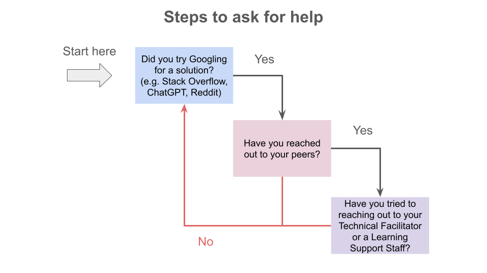

# Unix shell

## Content

* [Description](#description)
* [Learning Outcomes](#learning-outcomes)
* [Assignments](#assignments)
* [Contacts](#contacts)
* [Delivery of the Learning Module](#delivery-of-the-learning-module)
* [Schedule](#schedule)
* [Requirements](#requirements)
* [Resources](#resources)
  + [Cheat sheet](#cheat-sheet)
  + [Videos](#videos)
  + [How to get help](#how-to-get-help)
* [Folder Structure](#folder-structure)

## Description

This module introduces the Unix shell language and covers file and directory navigation and manipulation. Participants gain proficiency in various commands, script creation, and writing basic functions using pipes, filters, and loops. 

Participants will acquire problem-solving skills through live coding sessions. Additionally, they will explore the concept of reproducibility and its integration into their work.

## Learning Outcomes
By the end of the module, participants will be able to:
* Comfortably access and navigate the terminal
* Create, modify and delete directories and files

## Assignments

1. [The Secret Password Assignment](https://github.com/UofT-DSI/shell/blob/main/02_activities/assignments/assignment.md)

Participants should review the [Assignment Submission Guide](https://github.com/UofT-DSI/onboarding/blob/main/onboarding_documents/submissions.md) for instructions on how to complete assignments in this module.

## Contacts

**Questions can be submitted to the _#cohort-3-help_ channel on Slack**

* Technical Facilitator:   
  * **Simeon Wong** (he/him)  
    simeonm.wong@utoronto.ca

* Learning Support Staff: 
  * **Michaela Drouillard** (she/her)  
  michaela.drouillard@mail.utoronto.ca
  * **Julia Gallucci** (she/her)  
  julia.gallucci@mail.utoronto.ca
  * **Emma Teng**  
  e.teng@mail.utoronto.ca
 
## Delivery of the Learning Module

This module will include live learning sessions and optional, asynchronous work periods. During live learning sessions, the Technical Facilitator will introduce and explain key concepts and demonstrate core skills. Learning is facilitated during this time. Before and after each live learning session, the instructional team will be available for questions related to the core concepts of the module. Optional work periods are to be used to seek help from peers, the Learning Support team, and to work through the homework and assignments in the learning module, with access to live help. Content is not facilitated, but rather this time should be driven by participants. We encourage participants to come to these work periods with questions and problems to work through. 
 
Participants are encouraged to engage actively during the learning module. They key to developing the core skills in each learning module is through practice. The more participants engage in coding along with the instructional team, and applying the skills in each module, the more likely it is that these skills will solidify. 

## Schedule

||Day 1|Day 2|Day 3|Day 4|Day 5|
|---|---|---|---|---|---|
|Week 1|Live Learning Session 1 (Shell)|Live Learning Session 2 (Shell)|Live Learning Session 3 ([Git & GitHub](https://github.com/UofT-DSI/git))|Work Period 1|Work Period 2|
 
## Requirements

* Participants are not expected to have any coding experience; the learning content has been designed for beginners.
* Participants are encouraged to ask questions, and collaborate with others to enhance their learning experience.
* Participants must have a computer and an internet connection to participate in online activities.
* Participants must not use generative AI such as ChatGPT to generate code in order to complete assignments. It should be used as a supportive tool to seek out answers to questions you may have.
* We expect participants to have completed the steps in the [onboarding repo](https://github.com/UofT-DSI/onboarding/).
* We encourage participants to default to having their camera on at all times, and turning the camera off only as needed. This will greatly enhance the learning experience for all participants and provides real-time feedback for the instructional team. 

## Resources

Feel free to use the following as resources:

### Cheat sheet
- [Devhints](https://devhints.io/bash)
- [Bash-Cheat-Sheet](https://github.com/RehanSaeed/Bash-Cheat-Sheet)

### Videos
- [Change Directory](https://www.youtube.com/watch?v=6U4XV4w8qtE)
- [Deleting Files and Directories](https://www.youtube.com/watch?v=-L3XeZPwj_Y)
- [Bash in 100 seconds](https://www.youtube.com/watch?v=I4EWvMFj37g)

### How to get help


<hr>

## Folder Structure
Below is an outline of the folder structure for this module:
```
.
├── .github
├── 01_materials
├── 02_activities
├── 03_instructional_team
├── 04_cohort_three
├── .gitignore
├── LICENSE
├── README.md
└── steps_to_ask_for_help.png
```
* **.github**: Contains issue templates and pull request templates for the repository.
* **materials**: Module slides and interactive notebooks (.ipynb files) used during learning sessions.
* **activities**: Contains graded assignments, exercises, and homework to practice concepts covered in the learning module.
* **instructional_team**: Resources for the instructional team.
* **cohort_three**: Additional materials and resources for cohort three.
* **.gitignore**: Files to exclude from this folder, specified by the Technical Facilitator
* **LICENSE**: The license for this repository.
* **README**: This file.
* **steps_to_ask_for_help.png**: Guide on how to ask for help.
