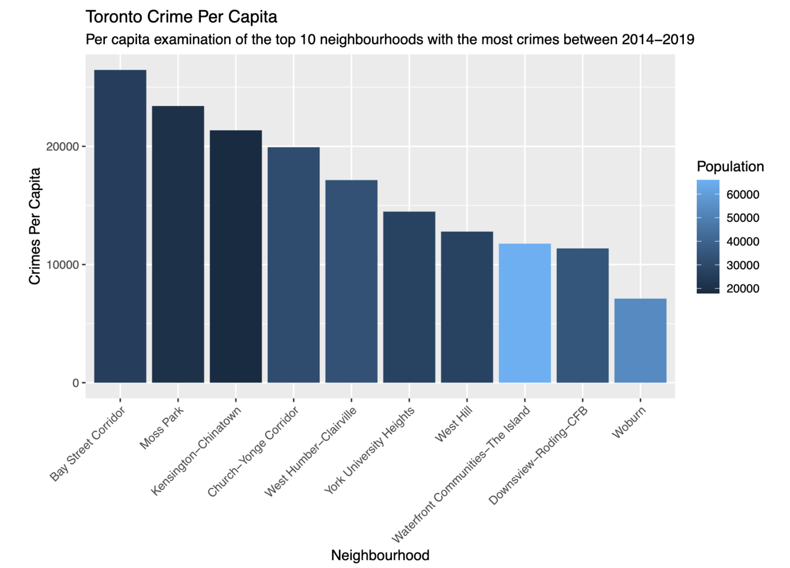
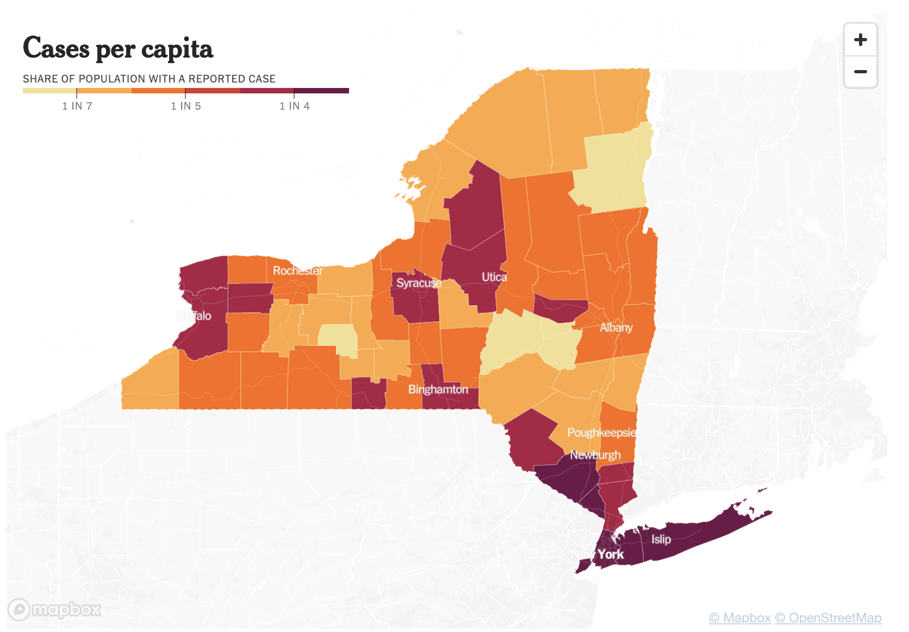
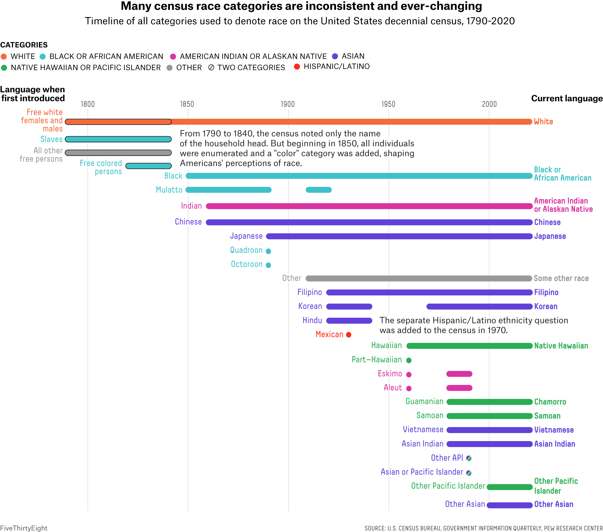

<style>
    p {
        text-align: left;
        font-size: 35px
    }
    ul {
        margin: 0;
        font-size: 35px;
    }
    table {
        font-size: 35px;
    }
    ol {
        margin: 0;
        font-size: 35px;
    }

    blockquote {
        border-left: 10px solid #ccc;
        margin: 1.5em 10px;
        padding: 0.5em 30px;
        quotes: "\201C""\201D""\2018""\2019";
    }

    blockquote:before {
        color: #ccc;
        content: none;
        font-size: 4em;
        line-height: 0.1em;
        margin-right: 0.25em;
        vertical-align: -0.4em;
    }

    blockquote:after{
        content: none;
    }

    footer {
        margin-bottom: 0px;
        text-align: left;
    }
</style>


# **Ethics**
```bash
$ echo "Data Sciences Institute"
$ echo "Rachael Lam"
```

---
<!--_color: white -->
<!--_backgroundColor: #33857a -->
##### Why should we care about ethics in Data Science?

---
<!--_color: white -->
<!--_backgroundColor: #f4a534 -->
## `Who Counts in our`
## `Datasets?`

---
<!-- footer: Rachael Lam-->


---
<!-- footer: NYTimes-->


---
<!-- footer: Kieran Healy-->

- [Kieran Healy](https://kieranhealy.org/blog/archives/2020/05/21/the-kitchen-counter-observatory/)

---
<!-- footer: Mithani & Samuels-->


---
<!-- footer: Keyes-->
##### **Os Keyes: Counting the Countless**
>Trans lives are ultimately (to a certain degree) about autonomy: about the freedom to set one’s own path. Society isn’t a tremendous fan of this

---
> ...“administrative violence” to refer to the way that administrative systems such as the law — run by the state, that white supremacist capitalist patriarchy — “create narrow categories of gender and force people into them in order to get their basic needs met.”

---
> “data violence” refers to the perpetuation of violence through datalogical systems: everything from YouTube’s recommender algorithm to facial recognition to online advertising.

---
<!-- footer: ""-->
<!--_color: white -->
<!--_backgroundColor: #33857a -->
How do data science practices exclude people or communities?

---
<!-- footer: Keyes-->
- Normalizing and Standardizing
    - Open text boxes create data that is difficult to clean

    - A quantitative approach forces us to make buckets and decide the definitions of gender and constrains people's decisions to those buckets
- Consistency
    - Big data encourages us to collect as much data as possible in a standardized way

    - Developing a data history means that variation from the previously determined standardized approach complicates data collection thus is discouraged

---
<!-- footer: ""-->
<!--_color: white -->
<!--_backgroundColor: #33857a -->
Insurance companies are making decisions based on health data (ex. food you buy, exercise, etc.)
<br>

How might this practice exclude people or communities?

Is this practice even ethically reponsible?

---
<!-- footer: Keyes-->
> "The inhumane reduction of humanity down to what can be counted."

---
<!-- footer: "Kieran Healy"-->
##### **Kieran Healy: The Kitchen Counter Observatory**
>  Numbers and measures are crude; they pick up the wrong things; they strip out the meaning of what’s happening to real people; they make it easy to ignore what can’t be counted. There’s something to those complaints. But it’s mostly a lazy critique. In practice, I find that far from distancing you from questions of meaning, quantitative data forces you to confront them.

---
<!-- footer: ""-->
<!--_color: white -->
<!--_backgroundColor: #33857a -->
Do you think the reductionist appoach of data science make it easy to ignore realities, or does it force you to confront them as Healy states?

---
<!-- footer: Kieran Healy-->
##### **Reforming Data Science**
>With administrative violence, Spade notes how “reform” often benefits only the least marginalized while legitimizing the system and giving cover for it to continue its violence.

We can see this in facial recognition where people of colour are not well recognized by the program, yet creating a better algorithm only benefits systems of control.

---
<!-- footer: ""-->
<!--_color: white -->
<!--_backgroundColor: #33857a -->
Can you think of another product/algorithm/program that further marginalizes communities?

Do you believe we can reform data science?

---
##### **References**
- Healy, 2020, ‘The Kitchen Counter Observatory’, https://kieranhealy.org/blog/archives/2020/05/21/the-kitchen-counter-observatory/.
- Jasmine Mithani and Alex Samuels: https://fivethirtyeight.com/features/who-the-census-misses/
- Keyes, 2019, ‘Counting the Countless’, https://reallifemag.com/counting-the-countless/
- NYTimes: https://www.nytimes.com/interactive/2021/us/new-york-covid-cases.html
- Rachael: https://github.com/rachaellam/Toronto-Crime-Rates/blob/main/outputs/paper/toronto_crime_analysis.pdf
