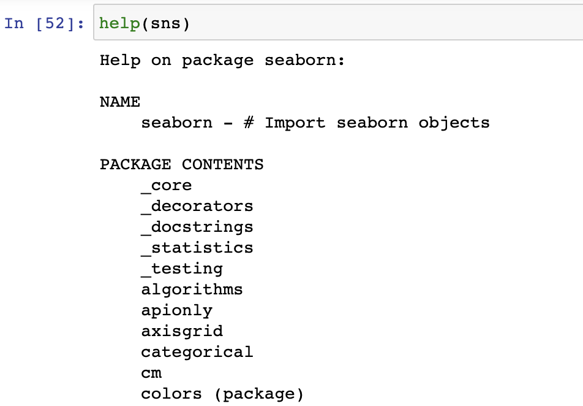

<style>
    p {
        text-align: left;
        font-size: 35px
    }
    ul {
        margin: 0;
        font-size: 35px;
    }
    table {
        font-size: 35px;
    }
    ol {
        margin: 0;
        font-size: 35px;
    }

    blockquote {
        border-left: 10px solid #ccc;
        margin: 1.5em 10px;
        padding: 0.5em 30px;
        quotes: "\201C""\201D""\2018""\2019";
    }

    blockquote:before {
        color: #ccc;
        content: none;
        font-size: 4em;
        line-height: 0.1em;
        margin-right: 0.25em;
        vertical-align: -0.4em;
    }

    blockquote:after{
        content: none;
    }
</style>


# **Problem Solving**
```bash
$ echo "Data Sciences Institute"
$ echo "Rachael Lam"
```


---
<!--_color: white -->
<!--_backgroundColor: #f4a534 -->
## `Identifying where`
## `the error is`

---
Our code can and will break often. Even experienced coders will have their code break several times throughout the day.

We need to first identify the error so we know what needs fixing

---
<!--_color: white -->
<!--_backgroundColor: #33857a -->
What are some of they ways you might identify where an error is in your code?

---
##### **Change the Code**
- The first step to fixing your code is identifying where the error or problem is. One of the best ways to do this is **by systematically changing one thing at a time**.

- Changing one thing allows us to see if the program works, breaks in the same way or breaks in a new way

- Changing code can be done by removing code until it doesn't break. We can delete the code, or we can comment it out (`#`) to save our work.

---
##### **Reading the Error Messages**
- Sometimes the error messages can quickly identify our problems, both the location and reason!
<br>


---


---
##### **Help**
- Programming languages often come with a help feature that give us more information about a package or command.
<br>



---
 &nbsp;&nbsp;&nbsp; 


---
<!--_color: white -->
<!--_backgroundColor: #f4a534 -->
## `Searching for`
##  `common errors`

---
It's helpful to understand some of the most common errors so that we can methodically work through our code and find our errors.

Sometimes the reason why our code is breaking is due to simple fixes such as missing parentheses.

---
##### **Common Errors**
Many times our errors are simple fixes:
1. Forgetting a `)` or having too many `)`

2. Not defining a variable before calling it 

3. Our indents don't line up
```python
for i in df['column']:
    if i == 100:
    print(i)
```

---
4. We're attempting to apply a function to a conflicting class
```python
for i in df['number_column']:
    if i == "100":
    print(i)
```
5. An object is not iterable
```python
a = 1
list(a)
```
```python
a = 1
dict(a)
```

---
Some of the most common Python Errors are:

1. SyntaxError: invalid syntax

2. NameError: name name is not defined
3. SyntaxError: unexpected EOF while parsing
4. IndentationError: unindent does not match any outer indentation level

---
##### **1. SyntaxError: invalid syntax**


---
##### **2. NameError: name name is not defined**


---
##### **3. SyntaxError: unexpected EOF while parsing**


---
##### **4. IndentationError: unindent does not match any outer indentation level**


---
<!--_color: white -->
<!--_backgroundColor: #f4a534 -->
## `Google and StackOverflow`

---
Learning how to search for our errors is probably one of the most valuable tools we have. Two of the best resources we have are *Google* and *StackOverflow*.

Google: A broad search across different resources

StackOverflow: Programming specific question and answer site

---


---


---


---
- When searching on Google or StackOverflow, add *python* or *R* to your search to narrow the results

- We can also search package specific questions such as *seaborn* or *pandas*


---
- We can search our error messages or what we're actually trying to do (ex. "Convert string to date python")

- The more we code and search, the more we'll learn specific language that will help us search (ex. "Group by multiple columns")

---
<!--_color: white -->
<!--_backgroundColor: #f4a534 -->
## `Reproducible Examples`

---
##### **Reprex**
- A reprex is a **REPR**oducible **EX**ample.

- It contains just enough of the code to reproduce the error, ie. it is **self-contained**

- We might have to create a smaller version of the code in order to create the reprex. Don't include anything that isn't related to the problem.

- Sometimes, this process will help us solve our issue.

---
##### **Inclusions**
A minimal dataset to demonstrate the problem. This could be a regularly used one such as *iris* 
```python
from sklearn import datsets
iris = datasets.load_iris() 
```

or one easily built yourself.
```python
d = {'col1': [1, 2], 'col2': [3, 4]}
df = pd.DataFrame(data=d)
df
```

---
- Make sure to include classes that are necessary to your reprex (ex. dates, factors, etc.)

- If you're using randomly sampled data, set the seed to so the same data is produced each time.
```python
df['column'].sample(n=3, random_state=1)
```

---
Include all packages that you need.
<br>

- Make sure they are placed at the top of the script so it's quick and easy to see what is necessary for the reprex.

---
##### **Other Inclusions**
- Details about the issues you are facing.

- Comments that will add clarification to your error.

- Add what fixes have been attempted. This could include pages to StackOverflow articles that you've viewed.

- Communicate cleary what you're desired outcome is.

---
**References:**
- [StackOverflow, How to make a great R reproducible example](https://stackoverflow.com/questions/5963269/how-to-make-a-great-r-reproducible-example)
- [Wickham, Advanced R](http://adv-r.had.co.nz/Reproducibility.html)
- [Wilson, Debugging](https://buildtogether.tech/debugging/)
